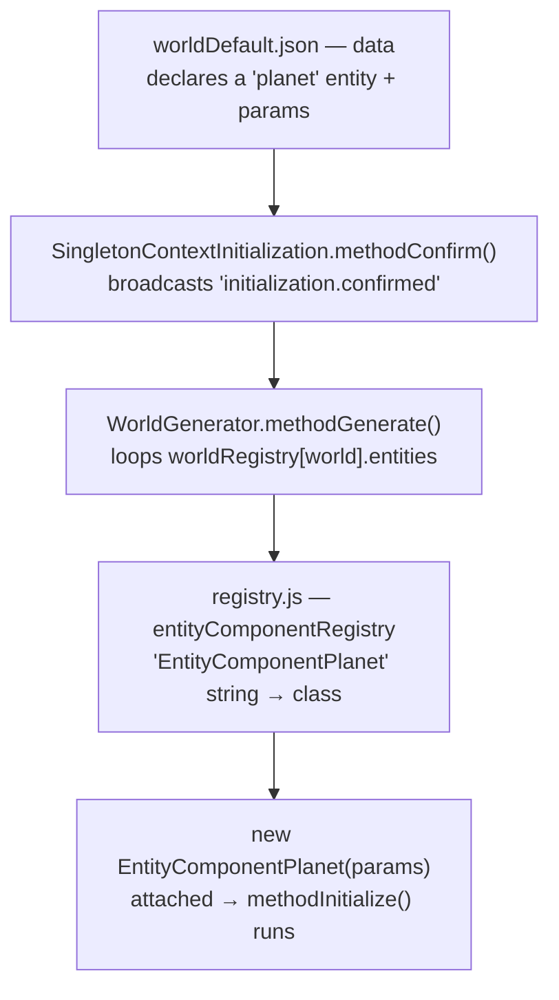
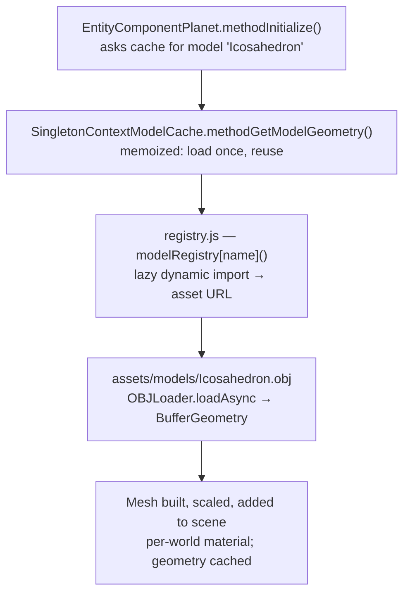

# The planet — mesh (slice #1) & face data (slice #2)

> Scope: how the icosahedron planet is loaded, sized, shown, and torn down (**slice #1**,
> the mesh), and — later — parsed into per-face gravity data (**slice #2**,
> `MultiContextPlanetFaces`, deferred). Builds on the lazy model-loading decisions in
> `DATA_DRIVEN_WORLDS_AND_PREFABS.md` §8 and increments 2–3 of `ECS_CONVERSION_PLAN.md`.

---

## Slice #1 — `EntityComponentPlanet` (the mesh)

**Goal:** a visible, correctly-sized planet in a world, generated on confirm and disposed
on return-to-menu. **No gravity, no face logic yet** — the player still spawns on the flat
ground at a random X/Z; spawn-on-face is slice #2.

### Design (settled 2026-09-11)
- **Entity topology.** A `planet` entity carries **only** `EntityComponentPlanet`. The face
  data (`MultiContextPlanetFaces`, slice #2) is a **separate** Context entity — never a sibling
  (see `NAMING_CONVENTIONS.md` §6, "Context components live alone on their own entity").
- **Folder / name.** `entity components/environment/planet.js` → `EntityComponentPlanet`
  (plain domain name; it's a scene object, not a Context/Manager/Controller).
- **Params (from world JSON).** `{ model: "Icosahedron", radius: <n>, color: "#FFFFFF" }`.
  `color` is per-world (default white, immaterial). Opt-in: a world without a planet just
  omits the entity.
- **Load — async, lazy, memoized via `SingletonContextModelCache`.** `async methodInitialize()` looks up
  the session-lived **`SingletonContextModelCache`** and `await`s `methodGetModelGeometry(model)`. That
  context owns the load (`modelRegistry[model]()` → `OBJLoader.loadAsync`) and **memoizes the
  unscaled geometry** in a `Map` keyed by model name. A world never picked never fetches its
  model; re-entry reuses the cached geometry. The planet imports neither `modelRegistry` nor
  `OBJLoader` — that's what keeps it out of the import cycle.
- **Per-world mesh.** `new THREE.Mesh(cachedGeometry, material)`, `mesh.scale.setScalar(radius)`,
  added to the world scene at the origin. Material: lit
  `MeshStandardMaterial({ color, flatShading: true })`, `castShadow`/`receiveShadow` on
  (facets must read distinctly for the gravity work later).
- **Dispose.** `scene.remove(mesh)` + dispose the **per-world material**; **never** dispose
  the cached geometry (it's a persistent asset — the kept-vs-disposable resource tiers of the
  deferred-deletion design).
- **Exposes** (for slice #2): `methodGetGeometry()` (the unscaled geometry) + `methodGetRadius()`.
  `MultiContextPlanetFaces` will multiply face centers by `radius` for world space; face normals
  are scale-invariant under uniform scale.

### Runtime flow — data → class → instance → mesh

Generation is *generic*: the code never names the planet — **data** does. Two hops.

**1. How the entity is created** (declaration → instantiation):



**2. How the instance gets its mesh** (the component resolves its own asset via the cache context):



**The seams:** the planet is named **by string in data**; the two **registries** are the only
string→real-thing bridges — `entityComponentRegistry` (string→class) and `modelRegistry`
(string→lazy asset URL). The generator instantiates; the instance self-resolves its geometry
through `SingletonContextModelCache`. (Pretty standalone copies live in the shared threejs notes folder:
`planet_generation_flow.svg` / `planet_model_resolution_flow.svg`.)

### Implementation steps → a visible planet
1. **Asset in place.** `assets/models/Icosahedron.obj` (ported from `dilsency/threejs`).
2. **`modelRegistry`** in `classes/loading-from-json/registry.js` — a **hand-listed** lazy map,
   one entry per model: `{ "Icosahedron": modelIcosahedron }`, where `modelIcosahedron()` returns
   `import('../../assets/models/Icosahedron.obj?url').then(m => m.default)`. (The `import.meta.glob`
   auto-collect form is the deferred scale-up — see `SCALE_WHEN_NEEDED.md`.)
3. **`EntityComponentSingletonContextModelCache`** in `entity components/context/singleton/context_model_cache.js` —
   owns the cache + the load: `modelRegistry[name]()` → `OBJLoader.loadAsync` (from
   `three/addons/loaders/OBJLoader.js`) → the first mesh's geometry, memoized in a `Map` keyed by
   model name. Built once at startup in `main.js` `initContextComponents()` as the
   `"SingletonContextModelCache"` entity (session-lived, never torn down).
4. **`EntityComponentPlanet`** in `entity components/environment/planet.js` — the design above;
   imports only `THREE` + `EntityComponent`, looks up `SingletonContextModelCache`, and `await`s the
   geometry (so it never imports `modelRegistry`/`OBJLoader` — no import cycle).
5. **Register** `EntityComponentPlanet` in `entityComponentRegistry`. (`SingletonContextModelCache` is a
   startup context — built in `main.js`, *not* registered here.)
6. **Data.** Add a `planet` entity to `worldDefault.json` (and `worldB.json`):
   `{ "name": "planet", "components": [ { "type": "EntityComponentPlanet",
   "params": { "model": "Icosahedron", "radius": 20, "color": "#FFFFFF" } } ] }`.
7. **Verify in-browser.** Menu → pick a world → a flat-shaded planet of that radius appears
   at the origin; walk near it; return-to-menu disposes it cleanly (no leak, background
   restored); re-enter reuses the cached geometry.

**Done when:** a visible, correctly-sized, lit planet renders in both worlds and survives a
menu↔world cycle cleanly. (Player-on-flat-ground is expected at this stage.)

---

## Slice #2 — `EntityComponentMultiContextPlanetFaces` + spawn-on-face

**Spec (settled 2026-09-15). Scope: core + spawn.** Parse the icosahedron into per-face data
and spawn the player on a chosen face. **Multi-planet-ready by design**, one planet authored
for now.

**Deferred to the gravity slice** (see `SCALE_WHEN_NEEDED.md`): `getNearestFace`,
`isWithinFace`, the outer-wall planes, the `helper_mesh.js` port (its two bug-fixes —
`getNormalTriangleData` first-vertex, dead `getSignOfPointInTriangle` `return`), and
**orientation** (aligning "up" to the face normal). So in this slice the player spawns
*positioned* on a face but still world-Y up.

### Decisions
- **Icosahedron 1:1** — 20 triangles = 20 faces; no coplanar bucketing / normal-hash. A
  different flat-faced shape (dodecahedron) → a *separate* builder later, behind the same face
  interface (`SCALE_WHEN_NEEDED.md`).
- **Multi-instance Context** — per-**planet**, its own entity, in
  `entity components/context/multi/`. Consumers reference a *specific* instance via **`$ref`**,
  not a fixed-name lookup (that's the whole point of the `MultiContext` role).
- **The faces-context is the player's "active planet" reference** (not the planet mesh) — it
  holds the face data *and* a `$ref` to its planet; the future planet-switch mechanism re-points it.

### `EntityComponentMultiContextPlanetFaces` (`context/multi/`)
- **Param:** `planet` = `$ref` → that planet's `EntityComponentPlanet`.
- **Lazy parse** (`methodUpdate`): resolve the `planet` `$ref`; once its geometry is loaded
  (`methodGetGeometry()` non-null) parse **once**, set `#isReady`, then early-return forever.
- **Parse:** iterate triangles (`geometry.index` if present, else sequential position triples).
  Per face `i`: `centerLocal = (a+b+c)/3`; `normal = normalize(cross(b−a, c−a))`, flipped outward
  if `dot(normal, centerLocal) < 0` (convex mesh centered at origin — **no vertex normals**, so
  the buggy `getNormalTriangleData` is never needed). Store **world-space**
  `center = planetPosition + centerLocal × radius`.
- **Exposes:** `methodGetFaceCount()`, `methodGetFaceCenter(i)` (world), `methodGetFaceNormal(i)`,
  `methodGetIsReady()`.
- **Debug** (`debug` param, default off): an `ArrowHelper` per face center along its normal;
  removed in `methodDispose`.
- **Dispose:** drop parsed arrays; remove debug arrows. (Per-world; swept on teardown.)

### `EntityComponentPlanet` — amendment
- Add a **`position` param** (default origin); mesh placed at `position`, scaled by `radius`.
  (Enables multiple planets at distinct spots; face centers use it.)

### `EntityComponentPlayerSpawnOnFace` (on the Player prefab)
- **Params:** `faces` = `$ref` → the target `MultiContextPlanetFaces`; `spawnFaceIndex` (default
  0); `spawnDistance` (default 2, world units along the normal).
- **Lazy one-shot** (`methodUpdate`): resolve `faces`; if not ready, return; once ready →
  `position = getFaceCenter(i) + getFaceNormal(i) × spawnDistance` → `methodSetPosition(position)`
  (broadcasts `update.position` to the camera rig) → set `#hasSpawned`; thereafter return.
- Coexists with the startup ground-spawn (`SingletonContextPlayerInitialization` → the camera
  controller): the player briefly sits at the ground X/Z, then snaps to the face once ready.

### Runtime chain (all lazy / guarded)
`PlayerSpawnOnFace` waits on `MultiContextPlanetFaces.methodGetIsReady()` → which waits on
`EntityComponentPlanet.methodGetGeometry()` (async OBJ load) → which waits on
`SingletonContextModelCache`. Each hop is a `$ref`/null guard — no ordering assumptions.

### Data (per world, multi-planet-ready)
```jsonc
{ "name": "planet",      "components": [{ "type": "EntityComponentPlanet",
    "params": { "model": "Icosahedron", "radius": 20, "color": "#00FF00" } }] },
{ "name": "planetFaces", "components": [{ "type": "EntityComponentMultiContextPlanetFaces",
    "params": { "planet": { "$ref": { "entity": "planet", "component": "EntityComponentPlanet" } } } }] },
// Player prefab gains PlayerSpawnOnFace; per-world overrideParams targets the faces + face:
"EntityComponentPlayerSpawnOnFace": {
    "faces": { "$ref": { "entity": "planetFaces", "component": "EntityComponentMultiContextPlanetFaces" } },
    "spawnFaceIndex": 0, "spawnDistance": 2 }
```

### Registration
`EntityComponentMultiContextPlanetFaces` + `EntityComponentPlayerSpawnOnFace` added to
`entityComponentRegistry` (both JSON-spawned). `PlayerSpawnOnFace` added to `data/prefabs/player.json`.

### `$ref` resolution
Both components resolve their `$ref` via the lazy dependency-resolution pattern: store the
descriptor, each `methodUpdate` try `methodGetEntityByName(ref.entity).methodGetComponent(ref.component)`
until it succeeds, then cache. Hydration passes `$ref` through untouched (loader-side).

### Verify
Pick `spawnFaceIndex`; confirm the player spawns at that face's position. **Drop `radius` to
~3–5** to see the planet as a discrete object (at 20 the player spawns inside it → invisible
from inside). Optional debug arrows to eyeball the parse. Return-to-menu tears down cleanly.

### Build order
1. `EntityComponentPlanet` `position` param. 2. `EntityComponentMultiContextPlanetFaces`
(`context/multi/`) + register. 3. `EntityComponentPlayerSpawnOnFace` + register + add to player
prefab. 4. World JSON: `planetFaces` entity + player `overrideParams`. 5. Verify in-browser.
