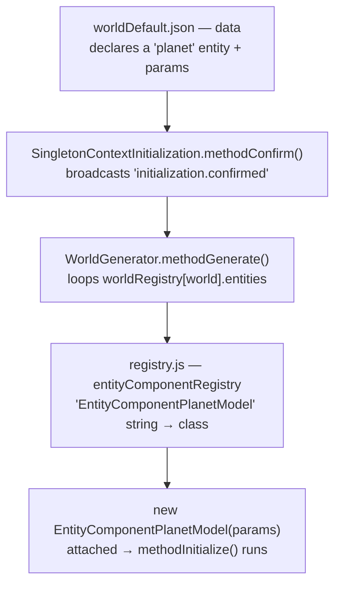
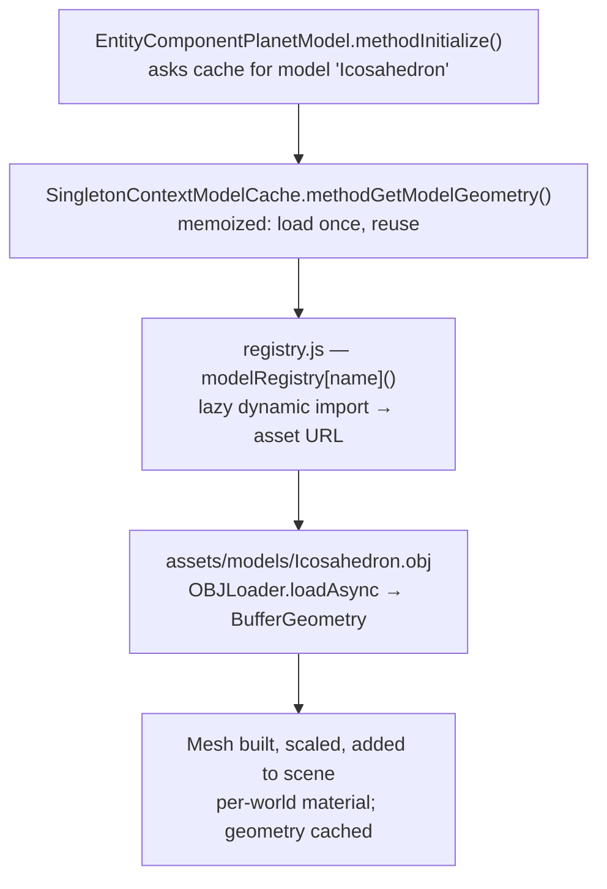

# The planet — mesh (slice #1) & face data (slice #2)

> Scope: how the icosahedron planet is loaded, sized, shown, and torn down (**slice #1**,
> the mesh), and parsed into per-face gravity data (**slice #2**, `EntityComponentPlanetFaces`
> — a plain component **co-located on the planet entity**, alongside the mesh). Builds on the
> lazy model-loading decisions in `DATA_DRIVEN_WORLDS_AND_PREFABS.md` §8 and increments 2–3 of
> `ECS_CONVERSION_PLAN.md`.

---

## Slice #1 — `EntityComponentPlanetModel` (the mesh)

**Goal:** a visible, correctly-sized planet in a world, generated on confirm and disposed
on return-to-menu. **No gravity, no face logic yet** — the player still spawns on the flat
ground at a random X/Z; spawn-on-face is slice #2.

### Design (settled 2026-09-11)
- **Entity topology.** The `planet` entity carries `EntityComponentPlanetModel` (the mesh) and — from
  slice #2 — `EntityComponentPlanetFaces` (the surface / face data) as a **sibling on the same
  entity**. The face data is an *intrinsic facet of the planet*, not ambient state, so it is a
  plain component, **not** a Context, and it reads its sibling mesh directly via the shared entity
  (no `$ref` between them). See `NAMING_CONVENTIONS.md` §6, "Entity topology — co-locate a facet,
  isolate ambient state".
- **Folder / name.** `entity components/environment/planet.js` → `EntityComponentPlanetModel`
  (plain domain name; it's a scene object, not a Context/Manager/Controller).
- **Params (from world JSON).** `{ model: "Icosahedron", radius: <n>, color: "#FFFFFF" }`.
  `color` is per-world (default white, immaterial). Opt-in: a world without a planet just
  omits the entity.
- **Load — async, lazy, memoized via `SingletonContextModelCache`.** `async methodInitialize()` looks up
  the session-lived **`SingletonContextModelCache`** and `await`s `methodGetModelGeometry(model)`. That
  context owns the load (`modelRegistry[model]()` → `OBJLoader.loadAsync`) and **memoizes the
  unscaled geometry** in a `Map` keyed by model name. A world never picked never fetches its
  model; re-entry reuses the cached geometry. The planet imports neither `modelRegistry` nor
  `OBJLoader` — that's what keeps it out of the import cycle.
- **Per-world mesh.** `new THREE.Mesh(cachedGeometry, material)`, `mesh.scale.setScalar(radius)`,
  added to the world scene at the origin. Material: lit
  `MeshStandardMaterial({ color, flatShading: true })`, `castShadow`/`receiveShadow` on
  (facets must read distinctly for the gravity work later).
- **Dispose.** `scene.remove(mesh)` + dispose the **per-world material**; **never** dispose
  the cached geometry (it's a persistent asset — the kept-vs-disposable resource tiers of the
  deferred-deletion design).
- **Exposes** (for slice #2): `methodGetGeometry()` (the unscaled geometry) + `methodGetRadius()`
  (+ `methodGetPosition()` once the `position` param lands). The sibling `EntityComponentPlanetFaces`
  reads these directly off the same entity to build world-space face centers (`position + centroid ×
  radius`); face normals are scale-invariant under uniform scale.

### Runtime flow — data → class → instance → mesh

Generation is *generic*: the code never names the planet — **data** does. Two hops.

**1. How the entity is created** (declaration → instantiation):



**2. How the instance gets its mesh** (the component resolves its own asset via the cache context):



**The seams:** the planet is named **by string in data**; the two **registries** are the only
string→real-thing bridges — `entityComponentRegistry` (string→class) and `modelRegistry`
(string→lazy asset URL). The generator instantiates; the instance self-resolves its geometry
through `SingletonContextModelCache`. (Pretty standalone copies live in the shared threejs notes folder:
`planet_generation_flow.svg` / `planet_model_resolution_flow.svg`.)

### Implementation steps → a visible planet
1. **Asset in place.** `assets/models/Icosahedron.obj` (ported from `dilsency/threejs`).
2. **`modelRegistry`** in `classes/loading-from-json/registry.js` — a **hand-listed** lazy map,
   one entry per model: `{ "Icosahedron": modelIcosahedron }`, where `modelIcosahedron()` returns
   `import('../../assets/models/Icosahedron.obj?url').then(m => m.default)`. (The `import.meta.glob`
   auto-collect form is the deferred scale-up — see `SCALE_WHEN_NEEDED.md`.)
3. **`EntityComponentSingletonContextModelCache`** in `entity components/context/singleton/context_model_cache.js` —
   owns the cache + the load: `modelRegistry[name]()` → `OBJLoader.loadAsync` (from
   `three/addons/loaders/OBJLoader.js`) → the first mesh's geometry, memoized in a `Map` keyed by
   model name. Built once at startup in `main.js` `initContextComponents()` as the
   `"SingletonContextModelCache"` entity (session-lived, never torn down).
4. **`EntityComponentPlanetModel`** in `entity components/environment/planet.js` — the design above;
   imports only `THREE` + `EntityComponent`, looks up `SingletonContextModelCache`, and `await`s the
   geometry (so it never imports `modelRegistry`/`OBJLoader` — no import cycle).
5. **Register** `EntityComponentPlanetModel` in `entityComponentRegistry`. (`SingletonContextModelCache` is a
   startup context — built in `main.js`, *not* registered here.)
6. **Data.** Add a `planet` entity to `worldDefault.json` (and `worldB.json`):
   `{ "name": "planet", "components": [ { "type": "EntityComponentPlanetModel",
   "params": { "model": "Icosahedron", "radius": 20, "color": "#FFFFFF" } } ] }`.
7. **Verify in-browser.** Menu → pick a world → a flat-shaded planet of that radius appears
   at the origin; walk near it; return-to-menu disposes it cleanly (no leak, background
   restored); re-enter reuses the cached geometry.

**Done when:** a visible, correctly-sized, lit planet renders in both worlds and survives a
menu↔world cycle cleanly. (Player-on-flat-ground is expected at this stage.)

---

## Slice #2 — `EntityComponentPlanetFaces` (co-located) + spawn-on-face — **implemented**

**Spec (settled 2026-09-15, revised same day — see "Topology decision").** Scope: **core +
spawn.** Parse the icosahedron into per-face data and spawn the player on a chosen face.
**Multi-planet-ready by design**, one planet authored for now.

**Status (2026-09-21): built and wired into both worlds**, matching
`entity components/environment/planet.js`. Two names differ from the original spec — see
"Naming — as implemented" below — and the parse went further than spec'd, also building the
wall planes originally deferred (next paragraph).

**Deferred to the gravity slice** (see `SCALE_WHEN_NEEDED.md`): `getNearestFace`,
`isWithinFace`, the `helper_mesh.js` port itself (its two known bugs —
`getNormalTriangleData` first-vertex, dead `getSignOfPointInTriangle` `return` — are moot,
since the floor/wall plane math was built directly in `EntityComponentPlanetFaces` instead
of porting that helper), and **orientation** (aligning "up" to the face normal). So in this
slice the player spawns *positioned* on a face but still world-Y up.

### Topology decision (why a co-located component, not a Context)
Face data is an **intrinsic facet of the planet** — its surface, where you stand, where gravity
pulls, where things spawn — not ambient state that floats above the world. So it is a **plain
`EntityComponent` co-located on the planet entity**, a *sibling* of `EntityComponent­Planet`, and
reads that mesh directly through their shared entity (`methodGetComponent`) — **no `$ref` between
them**. This is *not* a `Context`: the earlier "`MultiContextPlanetFaces` on its own entity" plan
was wrong — "read by other entities" is not what makes something a Context; **ownership** is, and
this data is owned by one planet. Full rationale: `NAMING_CONVENTIONS.md` §6 → "Entity topology".
Multi-planet still falls out for free: each planet entity carries its **own** faces sibling.

### Decisions
- **Icosahedron 1:1** — 20 triangles = 20 faces; no coplanar bucketing / normal-hash. A
  different flat-faced shape (dodecahedron) → a *separate* builder later, behind the same face
  interface (`SCALE_WHEN_NEEDED.md`).
- **The player's "active planet" reference is the planet _entity_** — the player `$ref`s that
  entity's `EntityComponentPlanetFaces` facet (cross-entity, so a `$ref` is right here). The
  future planet-switch mechanism re-points that reference at a different planet entity.
- **Naming:** the mesh component is **`EntityComponentPlanetModel`** (renamed from
  `EntityComponentPlanet` for symmetry with its sibling `EntityComponentPlanetFaces`); both live
  on the `planet` entity. File stays `environment/planet.js`.

### `EntityComponentPlanetFaces` (co-located on the `planet` entity, sibling of the mesh)
- **No `$ref` param** — it finds its mesh sibling on its own entity via `methodGetComponent(
  "EntityComponentPlanetModel")` (the shared parent entity). Optional `debug` param (default off).
- **Lazy parse** (`methodUpdate`): grab the mesh sibling; once its geometry is loaded
  (`methodGetGeometry()` non-null) parse **once**, set `#isReady`, then early-return forever.
- **Parse:** iterate triangles (`geometry.index` if present, else sequential position triples).
  Per face `i`: `centerLocal = (a+b+c)/3`; `normal = normalize(cross(b−a, c−a))`, flipped outward
  if `dot(normal, centerLocal) < 0` (convex mesh centered at origin — **no vertex normals**, so
  the buggy `getNormalTriangleData` is never needed). Store **world-space**
  `center = planetPosition + centerLocal × radius` (position/radius read off the mesh sibling).
- **Exposes:** `methodGetFaceCount()`, `methodGetFaceCenter(i)` (world), `methodGetFaceNormal(i)`,
  `methodGetIsReady()` (alias `methodHasOnLazyLoadInit()`).
- **Also builds, per face** (ahead of spec — pulled forward from the gravity slice): a floor
  `THREE.Plane` (`#planesFloor[i]`, via `setFromNormalAndCoplanarPoint`) and 3 wall `Plane`s
  (`#planesWall[i]`, one per edge, via `#methodCreatePlaneWalls`) — not yet exposed through a
  getter or consumed anywhere; built for the future gravity/collision work.
- **Debug** (`debug`, default off): an `ArrowHelper` per face center along its normal, **plus** a
  wireframe `PlaneGeometry` mesh per face (faked, not `THREE.PlaneHelper` — see `GOTCHAS.md`'s
  `PlaneHelper` entry for why); both removed in `methodDispose`. **This is the browser-visible
  payoff of Piece 2** — 20 arrows + 20 wireframe squares out of the faces.
- **Dispose:** remove + dispose debug arrows and debug plane meshes. (Per-world; swept on
  teardown. Parsed arrays/planes are not explicitly cleared on dispose — the whole component
  instance goes with the world.)

### `EntityComponentPlanetModel` — amendment
- Add a **`position` param** (default origin); mesh placed at `position`, scaled by `radius`, and
  exposed via `methodGetPosition()` so the faces sibling can build world-space centers.
  (Enables multiple planets at distinct spots.)

### `EntityComponentSpawnOnPlanetFace` (on the Player prefab) — naming differs from spec
Implemented as **`EntityComponentSpawnOnPlanetFace`** (spec'd as `EntityComponentPlayerSpawnOnFace`),
with param names **`planet`** (spec'd `faces`), **`faceIndex`** (spec'd `spawnFaceIndex`), and
**`faceDistance`** (spec'd `spawnDistance`, default 2 → implemented default 2.0, but both worlds
override it to `20.0`).
- **Params:** `planet` = `$ref` → the planet entity's `EntityComponentPlanetFaces`; `faceIndex`
  (default `null` → **random** face via `Math.floor(Math.random() * faceCount)` if unset, not a
  fixed default of 0 as spec'd); `faceDistance` (default 2.0, world units along the normal).
- **Lazy one-shot** (`methodUpdate`): resolve the `planet` `$ref`; if not ready — including
  waiting on the planet's own `methodGetIsReady()` — return; once ready →
  `position = getFaceCenter(faceIndex) + getFaceNormal(faceIndex) × faceDistance` →
  `methodSetPosition(position)` (bubbles up through the parent entity, broadcasting to the camera
  rig); **also**, if a sibling `EntityComponentCameraControllerFirstPerson` exists, calls its
  `methodLookAt(faceCenter)` to orient the view at the face — not in the original spec, added so
  spawning doesn't leave the player facing an arbitrary direction; then sets `#hasOnLazyLoadInit`
  and returns early on every later call.
- Coexists with the startup ground-spawn (`SingletonContextPlayerInitialization` → the camera
  controller): the player briefly sits at the ground X/Z, then snaps to the face once ready.
- **Wired in:** registered in `entityComponentRegistry` (`classes/loading-from-json/registry.js`),
  added to `data/prefabs/player.json` with `planet` pointed at
  `{ entity: "planet", component: "EntityComponentPlanetFaces" }` and `faceDistance: 20.0`, and
  both `worldDefault.json` / `worldB.json` override `faceDistance` to `20.0` (radius-20 planet, so
  the player spawns 20 units off the surface — matches the "outside the planet" expectation
  the spec called for by suggesting a smaller radius instead).

### Runtime chain (all lazy / guarded)
`SpawnOnPlanetFace` waits on `EntityComponentPlanetFaces.methodGetIsReady()` (resolved by `$ref`,
cross-entity) → which waits on its **sibling** `EntityComponentPlanetModel.methodGetGeometry()`
(same entity, direct `methodGetComponent`, async OBJ load) → which waits on
`SingletonContextModelCache`. Each hop is a `$ref`/null guard — no ordering assumptions.

### Data (per world, multi-planet-ready) — as implemented
```jsonc
// The planet entity carries BOTH facets — mesh + faces — as siblings:
{ "name": "planet", "components": [
    { "type": "EntityComponentPlanetModel",
      "params": { "model": "Icosahedron", "radius": 20, "color": "#00FF00" } },
    { "type": "EntityComponentPlanetFaces",
      "params": { "debug": true } } ] },
// Player prefab gains EntityComponentSpawnOnPlanetFace; per-world overrideParams tune faceDistance:
// (data/prefabs/player.json)
"EntityComponentSpawnOnPlanetFace": {
    "planet": { "$ref": { "entity": "planet", "component": "EntityComponentPlanetFaces" } },
    "faceDistance": 20.0 }
// (worldDefault.json / worldB.json overrideParams — faceIndex left unset → random face each run)
"EntityComponentSpawnOnPlanetFace": { "faceDistance": 20.0 }
```

### Registration
`EntityComponentPlanetModel`, `EntityComponentPlanetFaces` + `EntityComponentSpawnOnPlanetFace` are
all added to `entityComponentRegistry` (`classes/loading-from-json/registry.js`, one import from
`environment/planet.js`). `EntityComponentSpawnOnPlanetFace` added to `data/prefabs/player.json`,
alongside `EntityComponentCameraControllerFirstPerson` and `EntityComponentPlayerController`.

### `$ref` resolution
The **only** `$ref` in this slice is player → the planet's faces facet (cross-entity). It resolves
via the lazy dependency-resolution pattern: store the descriptor, each `methodUpdate` try
`methodGetEntityByName(ref.entity).methodGetComponent(ref.component)` until it succeeds, then cache.
The faces↔mesh link is **not** a `$ref` — same-entity siblings, direct `methodGetComponent`.
Hydration passes `$ref` through untouched (loader-side).

### Verify
Set a `faceIndex` (or leave it unset for a random face); confirm the player spawns at that face's
position, `faceDistance` off the surface, looking at the face. Both worlds ship with `radius: 20`
and `faceDistance: 20.0` — rather than shrinking the planet to see it from outside (the original
suggestion), the spawn distance was pushed out instead, so the player still starts outside the
mesh. `debug: true` is on in both worlds, so the 20 debug arrows **and** 20 wireframe floor
squares are visible on load. Return-to-menu tears down cleanly (arrows + plane meshes disposed).

### Build order (each piece is browser-checkable) — all done as of 2026-09-21
1. **Done.** `EntityComponentPlanetModel` `position` param → planet renders offset.
2. **Done.** `EntityComponentPlanetFaces` (co-located sibling, with `debug`) + register + add to
   the planet entity → 20 debug arrows + 20 debug wireframe floor squares (parse also builds
   floor/wall `Plane`s per face, ahead of spec, for the future gravity slice).
3. **Done**, as `EntityComponentSpawnOnPlanetFace` (name/param differences from spec — see above)
   + register + add to player prefab + world `overrideParams` → player snaps to the chosen (or
   random) face and looks at it.
4. **Done.** Wiring promoted to both `worldDefault.json` and `worldB.json`; working tree is clean
   and this is all committed (`1ebea31`).
