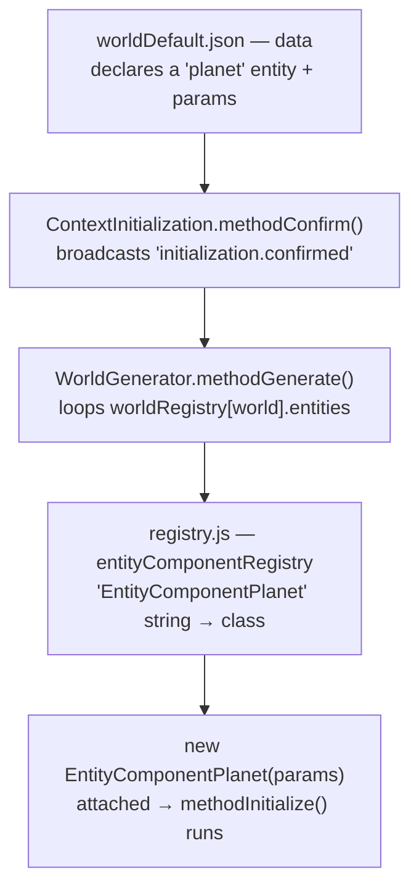
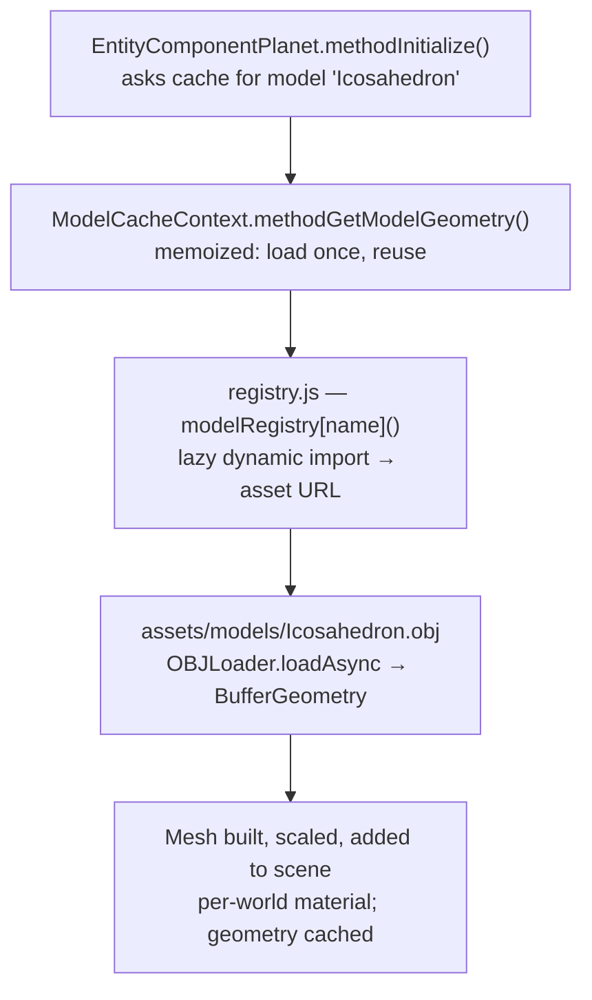

# The planet — mesh (slice #1) & face data (slice #2)

> Scope: how the icosahedron planet is loaded, sized, shown, and torn down (**slice #1**,
> the mesh), and — later — parsed into per-face gravity data (**slice #2**,
> `ContextPlanetFaces`, deferred). Builds on the lazy model-loading decisions in
> `DATA_DRIVEN_WORLDS_AND_PREFABS.md` §8 and increments 2–3 of `ECS_CONVERSION_PLAN.md`.

---

## Slice #1 — `EntityComponentPlanet` (the mesh)

**Goal:** a visible, correctly-sized planet in a world, generated on confirm and disposed
on return-to-menu. **No gravity, no face logic yet** — the player still spawns on the flat
ground at a random X/Z; spawn-on-face is slice #2.

### Design (settled 2026-09-11)
- **Entity topology.** A `planet` entity carries **only** `EntityComponentPlanet`. The face
  data (`ContextPlanetFaces`, slice #2) is a **separate** Context entity — never a sibling
  (see `NAMING_CONVENTIONS.md` §6, "Context components live alone on their own entity").
- **Folder / name.** `entity components/environment/planet.js` → `EntityComponentPlanet`
  (plain domain name; it's a scene object, not a Context/Manager/Controller).
- **Params (from world JSON).** `{ model: "Icosahedron", radius: <n>, color: "#FFFFFF" }`.
  `color` is per-world (default white, immaterial). Opt-in: a world without a planet just
  omits the entity.
- **Load — async, lazy, memoized via `ModelCacheContext`.** `async methodInitialize()` looks up
  the session-lived **`ModelCacheContext`** and `await`s `methodGetModelGeometry(model)`. That
  context owns the load (`modelRegistry[model]()` → `OBJLoader.loadAsync`) and **memoizes the
  unscaled geometry** in a `Map` keyed by model name. A world never picked never fetches its
  model; re-entry reuses the cached geometry. The planet imports neither `modelRegistry` nor
  `OBJLoader` — that's what keeps it out of the import cycle.
- **Per-world mesh.** `new THREE.Mesh(cachedGeometry, material)`, `mesh.scale.setScalar(radius)`,
  added to the world scene at the origin. Material: lit
  `MeshStandardMaterial({ color, flatShading: true })`, `castShadow`/`receiveShadow` on
  (facets must read distinctly for the gravity work later).
- **Dispose.** `scene.remove(mesh)` + dispose the **per-world material**; **never** dispose
  the cached geometry (it's a persistent asset — the kept-vs-disposable resource tiers of the
  deferred-deletion design).
- **Exposes** (for slice #2): `methodGetGeometry()` (the unscaled geometry) + `methodGetRadius()`.
  `ContextPlanetFaces` will multiply face centers by `radius` for world space; face normals
  are scale-invariant under uniform scale.

### Runtime flow — data → class → instance → mesh

Generation is *generic*: the code never names the planet — **data** does. Two hops.

**1. How the entity is created** (declaration → instantiation):

**2. How the instance gets its mesh** (the component resolves its own asset via the cache context):

**The seams:** the planet is named **by string in data**; the two **registries** are the only
string→real-thing bridges — `entityComponentRegistry` (string→class) and `modelRegistry`
(string→lazy asset URL). The generator instantiates; the instance self-resolves its geometry
through `ModelCacheContext`. (Pretty standalone copies live in the shared threejs notes folder:
`planet_generation_flow.svg` / `planet_model_resolution_flow.svg`.)

### Implementation steps → a visible planet
1. **Asset in place.** `assets/models/Icosahedron.obj` (ported from `dilsency/threejs`).
2. **`modelRegistry`** in `classes/loading-from-json/registry.js` — a **hand-listed** lazy map,
   one entry per model: `{ "Icosahedron": modelIcosahedron }`, where `modelIcosahedron()` returns
   `import('../../assets/models/Icosahedron.obj?url').then(m => m.default)`. (The `import.meta.glob`
   auto-collect form is the deferred scale-up — see `SCALE_WHEN_NEEDED.md`.)
3. **`EntityComponentContextModelCache`** in `entity components/context/context_model_cache.js` —
   owns the cache + the load: `modelRegistry[name]()` → `OBJLoader.loadAsync` (from
   `three/addons/loaders/OBJLoader.js`) → the first mesh's geometry, memoized in a `Map` keyed by
   model name. Built once at startup in `main.js` `initContextComponents()` as the
   `"ModelCacheContext"` entity (session-lived, never torn down).
4. **`EntityComponentPlanet`** in `entity components/environment/planet.js` — the design above;
   imports only `THREE` + `EntityComponent`, looks up `ModelCacheContext`, and `await`s the
   geometry (so it never imports `modelRegistry`/`OBJLoader` — no import cycle).
5. **Register** `EntityComponentPlanet` in `entityComponentRegistry`. (`ModelCacheContext` is a
   startup context — built in `main.js`, *not* registered here.)
6. **Data.** Add a `planet` entity to `worldDefault.json` (and `worldB.json`):
   `{ "name": "planet", "components": [ { "type": "EntityComponentPlanet",
   "params": { "model": "Icosahedron", "radius": 20, "color": "#FFFFFF" } } ] }`.
7. **Verify in-browser.** Menu → pick a world → a flat-shaded planet of that radius appears
   at the origin; walk near it; return-to-menu disposes it cleanly (no leak, background
   restored); re-enter reuses the cached geometry.

**Done when:** a visible, correctly-sized, lit planet renders in both worlds and survives a
menu↔world cycle cleanly. (Player-on-flat-ground is expected at this stage.)

---

## Slice #2 — `ContextPlanetFaces` (deferred)

The per-face parse (normal-hash buckets → normal / center / outer-walls), `getNearestFace` /
`isWithinFace`, world-space centers via `radius`, and the `helper_mesh.js` port with its two
bug fixes (`getNormalTriangleData` only writing its first vertex; the dead
`getSignOfPointInTriangle` `return`). Mostly maths — brainstormed separately, once slice #1
is on screen.
